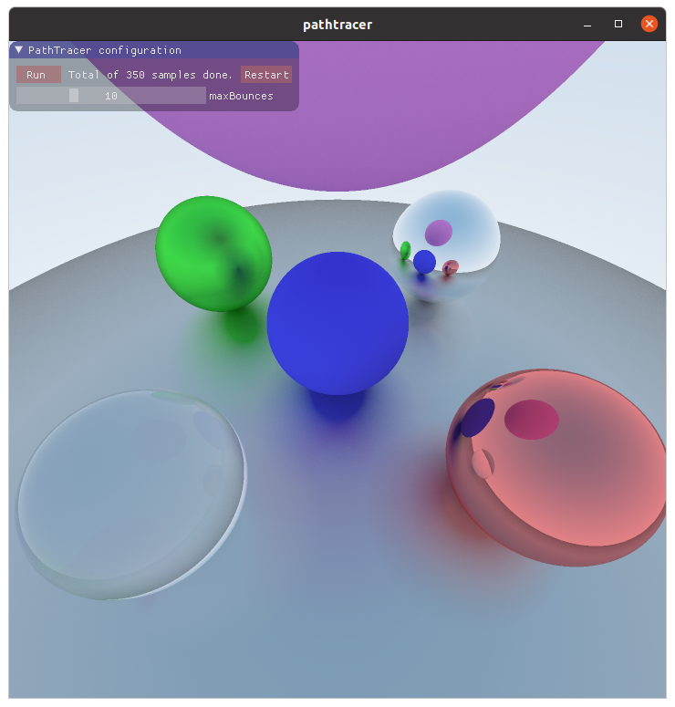
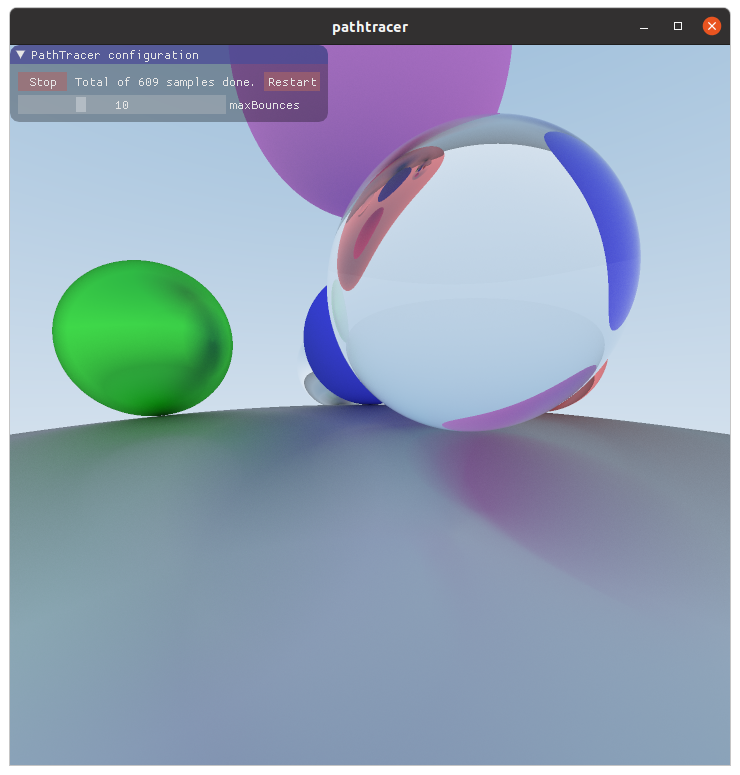

# GLSL Pathtracer

Pathtracer based on [Ray Tracing in One Weekend](https://raytracing.github.io/books/RayTracingInOneWeekend.html) by [Peter Shirley](https://github.com/petershirley). This one uses OpenGL ComputerShaders to reach better performance.

Screenshot 1                    | Screenshot 2                   | Screenshot 3 
:------------------------------:|:------------------------------:|:-------------------------:
|| 

## Thrid party code

You can find them on **include** and **third-party** folders.

 - [glad](https://github.com/Dav1dde/glad)
 - [glfw](https://www.glfw.org/)
 - [glm](https://glm.g-truc.net/0.9.9/index.html)
 - [imgui](https://github.com/ocornut/imgui)

## GNU/Linux

### Requirements

  - cmake
  - GNU make
  - GLFW is included as a third party library so it's built along with the project. Perhaps you will have to install x11 libraries.

### Compilation

```sh
$ cd path-to-project
$ mkdir build
$ cd build
$ cmake ..
$ make
```

## Windows

### Requirements
  - Microsoft Visual Studio with cmake (this is what I have tested)

### Compilation
Open *x86_64 Cross Tools Command Prompt for Visual Studio* (or similar)

```sh
$ cd path-to-project
$ mkdir build
$ cd build
$ cmake ..
$ msbuild pathtracer.sln
```

## Running

After building for your OS you will find the binary on **/bin** subfolder.

## License

This project is licensed under the GNU General Public License v3.0 - see the LICENSE file for details.
